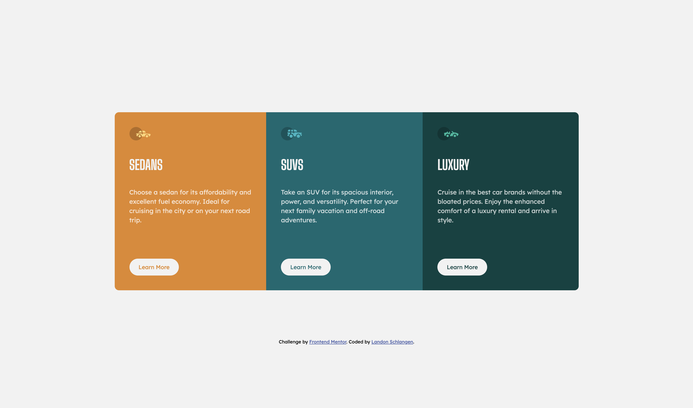
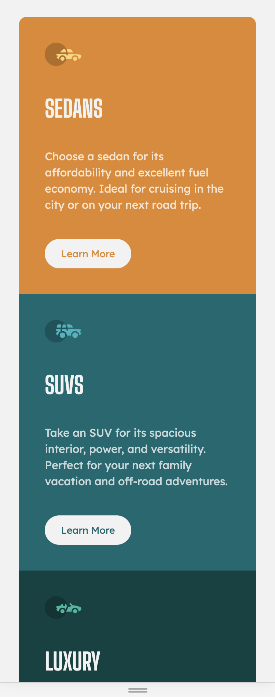

# Frontend Mentor - 3-column preview card component solution

This is a solution to the [3-column preview card component challenge on Frontend Mentor](https://www.frontendmentor.io/challenges/3column-preview-card-component-pH92eAR2-). Frontend Mentor challenges help you improve your coding skills by building realistic projects.

## Table of contents

- [Overview](#overview)
  - [The challenge](#the-challenge)
  - [Screenshot](#screenshot)
  - [Links](#links)
- [My process](#my-process)
  - [Built with](#built-with)
  - [What I learned](#what-i-learned)
  - [Continued development](#continued-development)
- [Author](#author)
- [Acknowledgments](#acknowledgments)

## Overview

### The challenge

Users should be able to:

- View the optimal layout depending on their device's screen size
- See hover states for interactive elements

### Screenshot




### Links

- Solution URL: [Frontend Mentor Solution Page](https://www.frontendmentor.io/solutions/responsive-preview-page-_Acg-Aroq)
- Live Site URL: [Github Pages Site](https://landon345.github.io/frontendmentor-3-column-preview-card-component/)

## My process

### Built with

- Reponsive design
- CSS custom properties
- Flexbox
- Mobile-first workflow

### What I learned

I learned how to use flexbox better. I also learned about the max-width css property.

```html
<div class="whole-card">
  <div class="sedans card">
    
    <h1>Sedans</h1>
    <p>
      Choose a sedan for its affordability and excellent fuel economy. Ideal for
      cruising in the city or on your next road trip.
    </p>
    <button class="learn-more">Learn More</button>
  </div>
  <div class="suvs card">
    
    <h1>SUVs</h1>
    <p>
      Take an SUV for its spacious interior, power, and versatility. Perfect for
      your next family vacation and off-road adventures.
    </p>
    <button class="learn-more">Learn More</button>
  </div>
  <div class="luxury card">
    
    <h1>Luxury</h1>
    <p>
      Cruise in the best car brands without the bloated prices. Enjoy the
      enhanced comfort of a luxury rental and arrive in style.
    </p>
    <button class="learn-more">Learn More</button>
  </div>
</div>
```

```css
@media screen and (min-width: 800px) {
  .whole-card {
    flex-direction: row;
    margin: 7%;
    max-width: 1100px;
  }
  .sedans {
    border-radius: 10px 0px 0 10px;
  }
  .luxury {
    border-radius: 0px 10px 10px 0px;
  }
  p {
    padding-bottom: 80px;
  }
}
```

### Continued development

I will continue to get better with css flexbox and spacing of elements.

## Author

- Website - [Landon Schlangen](https://www.landonschlangen.com/)
- Frontend Mentor - [@Landon345](https://www.frontendmentor.io/profile/Landon345)
- LinkedIn - [My Profile](https://www.linkedin.com/in/landon-schlangen-a3989a16b/)

## Acknowledgments

I was able to do this project in about 1 hour.
